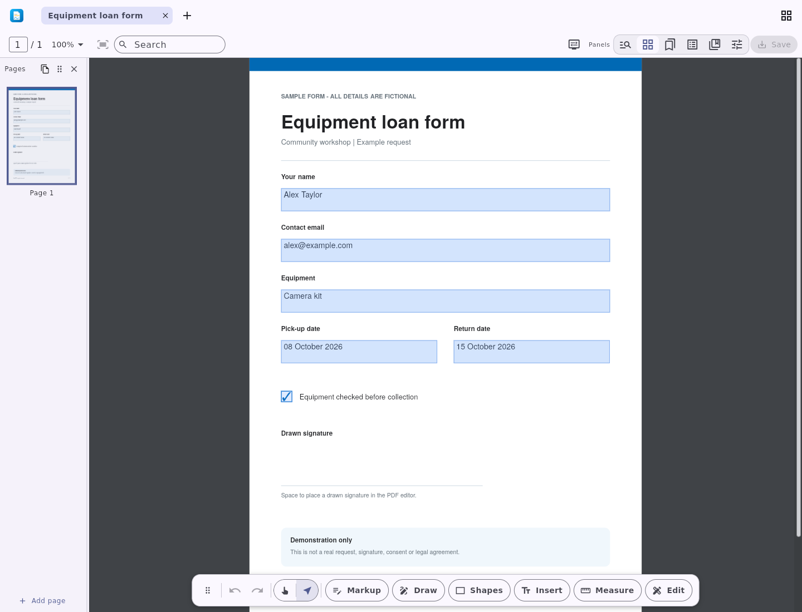

# DartPDF Arch package candidate

This repository prepares `dartpdf-bin` for Arch Linux using the official
DartPDF 8.0.0 Linux release. It is not yet published to the AUR. Do not use
`yay -S dartpdf-bin` or `paru -S dartpdf-bin` until an actual AUR listing is
verified.

The package keeps the upstream GUI, CLI, native libraries and desktop
integration. It installs the bundle under `/usr/lib/dartpdf`, with launchers at
`/usr/bin/dartpdf` and `/usr/bin/dartpdf-cli`.

The recipe repairs the Flutter plugins' upstream CI build-directory RUNPATH
so they resolve the bundled engine from their own directory. It does not drop
native plugins or disable source checksum validation.

## Validation

The manual workflow uses the official Arch base-devel container on a standard
public Ubuntu runner. It checks source integrity, generated `.SRCINFO`, native
`makepkg` output, package lint, installed files, the CLI and a headless GUI
window, then removes the test package. Direct ELF providers must be explicitly
declared and resolved, except the optional JNI helper's `libjvm.so`. Native
lint errors fail the workflow; warnings remain visible for review. These
checks do not validate the JNI feature or every editing workflow. Dependency
diagnostics are retained in the job log. It does not upload artifacts, create caches, deploy to a website
or publish to the AUR.

This is AI-assisted preparation. Successful build or launch checks are not a
review of every editing feature, an AUR acceptance decision or evidence of
new user installs. The source recipe comes from DartPDF's Apache-2.0
repository and retains that license.

## Published Snap capture

[DartPDF is available in the Snap Store](https://snapcraft.io/dartpdf).
Install the signed stable package with `sudo snap install dartpdf`.

This is the published 8.0.0+44 Snap running as a normal user on Ubuntu 22.04
with confinement enforced. The capture shows an existing fictional form;
its values were prefilled and its signature area is blank. It does not prove
editing, saving or signing. The [capture record](docs/linux-snap8-form.json)
links the exact native run and checksum. This is not an AppImage capture or
an AUR publication. Test installations are not acquired users.

## Publication requirements

Before AUR publication, verify the current catalog search, review the complete
native test results and dependency list, and regenerate `.SRCINFO` with
`makepkg --printsrcinfo`. Publication also needs the existing owner's AUR
account and approved SSH access. Do not accept account terms, add credentials
or submit an unvalidated package automatically.

- [Official DartPDF releases](https://github.com/ben-milanko/dart-pdf/releases)
- [AUR submission guidelines](https://wiki.archlinux.org/title/AUR_submission_guidelines)
- [Arch package guidelines](https://wiki.archlinux.org/title/Arch_package_guidelines)

The upstream repository remains the source of truth. Adopt validated packaging
changes there before using this repository as a publication mirror.
